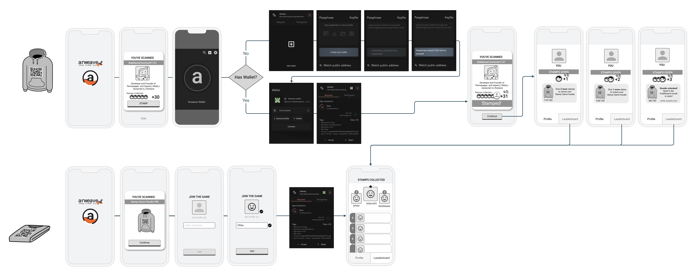

# swag.arweave.dev

SWAG is a webmobile game application that allows players to wear swag containing
a unique QR Code. And participants to scan the QR Code using their phones and
view the player and STAMP them. The number of STAMPs creates a Leaderboard. This
goal for each player is to talk to as many participants as possible and get them
to STAMP their player card. The benefit of the game is to spread as much
knowledge as possible about the community or team you are part of at
conferences.

- [SWAG Game](https://swag.arweave.dev)

## Design

- Figma -
  https://www.figma.com/file/ESyYxB5KKthUQZ65RXRFP6/arweave-swag-app?node-id=0%3A1&t=NnRQvtzjaT6ZshxO-1

## App Game Play Flow



## Contributing Guide

[Contributing Guide](CONTRIBUTING.md)

## API Docs

[API](API.md)

## Dev Environment

- Requires deno [v1.30.3] or higher - https://deno.com

```sh
deno task install
deno task dev
```

## Testing

```sh
deno task test
```

## Technical Stack

- Typescript or Javascript (w/JSDocs)
- Deno for development Runtime
- Vite for bundling
- Svelte, Twind, and DaisyUI for frontend
- Robot for state-machines
- date-fns for date formating
- Zod, Ramda, and Crocs for Business Logic
- Bundlr and Warp for Services

## Tests

```sh
deno task test
```

## Lint

```sh
deno task lint
```

## Tech Stack

- Deno - Development Runtime for HMR and DX Support
- Vite - Vite is the packager for both development and production environments
  built around esbuild
-

This project uses deno as its development runtime layer, which supports linting,
testing, and security.

## Game Logistics

# Setup

When you get your SWAG gear scan the qr code on the shirt to register your gear.
You will be asked to sign your wallet and use your ArProfile, and the name of
the conference to register in the SWAG STAMP Game. Once registered, you will
appear on the SWAG Game Leaderboard, and your QR Code will be STAMPable by other
players.

# Game Play

Anyone with a smartphone can scan your tag and view your stampable card and
choose to stamp it. They will need an Arweave Wallet from Arweave App, or they
can generate a wallet within in the game and save it as a keyFile on their
phone. They also can leave or post a note when they stamp.

# Realtime Leaderboard

As registered players get stamped throughout the game, their position on the
leaderboard grows, and of course the goal is to be the top player in the SWAG
Game.

Only one person can STAMP a member per event. As people STAMP their favorite
players these stamp cards will also appear on now.arweave.dev using the
render-with to show their player card.

# Player Card View

The player card view will be clickable from the leaderboard or from
now.arweave.dev, it is a render-with pattern
https://swag.arweave.dev/?tx={CARD_TX_ID} - will render the player card, it
should look like a game card with a background and avatar in a circle and a
description with contact icons, like the web3 profile header view on responsive
but better. https://rakis.arweave.dev. Then with a list of stamps that the
player received, the Stamp should show the avatar of the STAMPER, or a blank
Avatar, the handle of the STAMPER or the first 5 characters of the wallet
address, and their profile description, and finally a comment and datetime of
the STAMP

# Bonus:

Players can re-register to different conferences to play the game and view a
feed specific for that conference.
